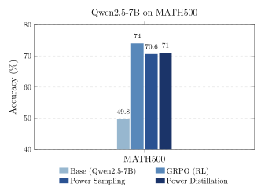

# Update (April 26, 2026)



As mentionned in our paper, we notice some sequence length issues and reran some experiements to fix them. In particular, we noticed that `Qwen/Qwen3-4B-Instruct-2507` often go over the sequence limit we set for the experiment, which could lead to bias in the results. We first tried to simply allow longer completion length, but this lead to some memory issues and made the experiment too long to run. To metigate the problem, we decided to rerun the experiment with a weaker/older model: `Qwen/Qwen2.5-7B`. Since this weaker model generates on average shorter completions, we can keep the sequence length fixed to a reasonable length. This also allow us to perform direct comparison with the original paper. We completly recover Power Samplings performances after only two training rounds.

# Power Distillation

Standalone code for the released power distillation experiments.

Supported starting models:

- `Qwen/Qwen3-4B-Base`
- `Qwen/Qwen3-4B-Instruct-2507`

Bundled datasets:

- `data/MATH_hendrycks_train.json`
- `data/MATH_test_L4_L5.json`

## Setup

```bash
python -m venv .venv
source .venv/bin/activate
pip install -r requirements.txt
```

## Train

Runs all rounds up to `--max_rounds` in one invocation.

```bash
python -m power_distillation.iterative \
  --base_model Qwen/Qwen3-4B-Instruct-2507 \
  --prompts data/MATH_hendrycks_train.json \
  --output_dir outputs/run01 \
  --eval_dataset data/MATH_test_L4_L5.json \
  --n_samples 16 \
  --prompts_per_round 5000 \
  --tp 4 \
  --sample_temperature 1.0 \
  --sample_prompt_template raw \
  --target_ess_ratio 0.3 \
  --effective_batch 32 \
  --batch_size 4 \
  --lr 5e-6 \
  --max_seq_length 2048 \
  --eval_max_tokens 3072 \
  --eval_temperature 0.6 \
  --eval_top_p 0.95 \
  --eval_prompt_template math_wrapped \
  --eval_use_eos_stop \
  --max_rounds 24
```

To run from the base model, replace `Qwen/Qwen3-4B-Instruct-2507` with `Qwen/Qwen3-4B-Base`.

## Pass@k Eval

```bash
python -m power_distillation.evaluate_passk \
  --model Qwen/Qwen3-4B-Instruct-2507 \
  --dataset data/MATH_test_L4_L5.json \
  --tensor_parallel_size 4 \
  --output_dir outputs/passk_eval \
  --temp 0.6 \
  --max_tokens 2048 \
  --best_of_n 16 \
  --pass_k 1 4 8 16
```
